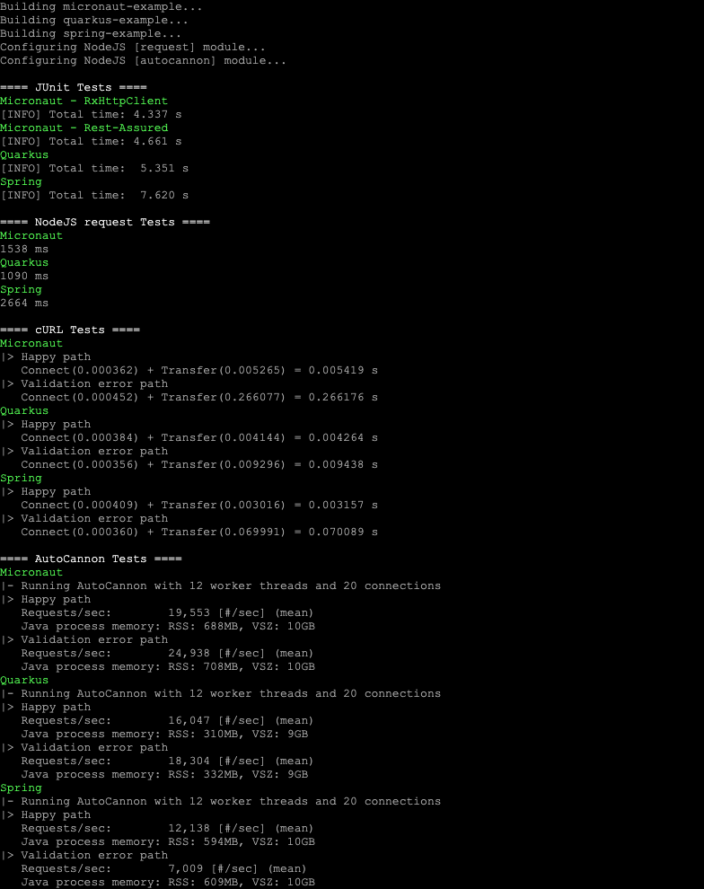

# 2021: Micronaut 2.4.2 vs Quarkus 1.13.0.Final vs Spring Boot 2.4.3 on JDK 11

This repo provides a **modified** version of the original [2020: Performance comparison between Micronaut 2.0 M2 vs Quarkus 1.3.1 vs Spring Boot 2.3 M2 on JDK 14](https://github.com/graemerocher/framework-comparison-2020).

## Changes
- Uses JDK11 instead of JDK14
- Minimal/no logging for all frameworks
- Micronaut: 
  - Updated to v2.4.2
  - Included a Rest-Assured test
- Quarkus:
  - Updated to v1.13.0.Final 
  - Configuration set to use port 8080
- Spring Boot:
  - Updated to v2.4.3
  - Configuration set to use port 8080

## Framework benchmarks
- JUnit happy-path timed request
- NodeJS happy-path timed request
- cURL happy+invalid path timed requests
- AutoCannon happy+invalid path requests/sec with server JVM metrics
- _Deprecated_: ApacheBench happy+invalid path requests/sec with server JVM metrics

## Running the benchmarks

### Build and run all benchmarks
The all-in-one script to build and run all benchmarks:
```sh
./buildAndRunAllTests.sh
``` 

Alternatively: 
1. Build the projects and install dependencies: 
```sh
./build.sh
``` 

2. Run all benchmarks:
```sh
./runAllTests.sh
``` 

### Junit benchmarks

```sh
./runJunitTests.sh
``` 

### NodeJS benchmarks

```sh
./runNodeTests.sh
``` 

### cURL benchmarks

```sh
./runCurlTests.sh
``` 

### AutoCannon benchmarks

```sh
./runAutoCannonTests.sh
``` 

### ApacheBench benchmarks (deprecated)

```sh
./runABTests.sh
``` 

## Sample results

```sh
./buildAndRunAllTests.sh
``` 
